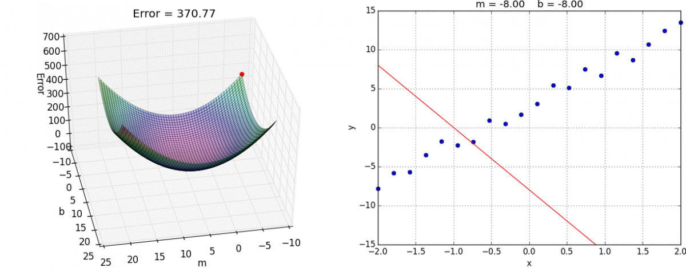

## Python4ML
 
### [Machine Learning with Python🐍](https://github.com/hiteshsahu/Python4ML)

  

---
## Learning Progress

#### [1. Python & Linear Regression📈](./src/ml/MultiVarientLinearRegression.md)

- [Python Hard Way🐍](./src/python/Index.md)
- [ML Tools](./Tools.md)
- [Machine Learning 🤖](./src/ml/Index.md)
- [Linear Regression📈](./src/ml/LinearRegression.md)
- [Gradient Descent & Cost Function📈](./src/ml/LinearRegression.md)
- [Matrix Algebra📈](./src/ml/LinearRegression.md)

#### [2. Multi Variant Linear Regression & Normal Equation📈](./src/ml/MultiVarientLinearRegression.md)

- [Study Notes MatLab📈](./src/matlab/MathLab.md)
- [Multi Variant Linear Regression📈](./src/ml/MultiVarientLinearRegression.md)
- [Feature Scaling📈](./src/ml/MultiVarientLinearRegression.md)
- [Polynomial Regression📈](./src/ml/MultiVarientLinearRegression.md)
- [Normal Equations📈](./src/ml/NormalEquation.md)

## References
[Official Python Documentation](https://docs.python.org/3/tutorial/index.html)
- Best place to learn Python, but it is not a course, just a documentation. You need to have some basic understanding of programming to understand the documentation.

[Google Crash Course on Python](https://www.coursera.org/learn/python-crash-course/home/module/1)
- Annoying af course with bright colors and no content, just videos of girls talking about Python. Waste of time.

[Dr Chuck's Python for Everybody](https://www.coursera.org/learn/python/lecture/GoNcs/welcome-to-class-dr-chuck)
- Best course to learn Python, it is a complete course with assignments and quizzes. It is

