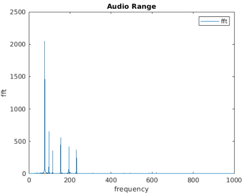

## MatLab (MATrix LABoratory)

Finding Help

> doc fn = document for function n
>
### [Operators📈 Overview](./Operators.md)

  

### [Data Types](https://in.mathworks.com/help/matlab/data-types.html?s_tid=CRUX_lftnav)

- #### Numeric Types
Integer and floating-point data

      - unsigned Int: uint8, uint16, uint32, uint64
      - signed Int: int8, int16, int32, int64
      - single : 4 byte float
      - double : 8 byte double precision

-  #### Characters and Strings
Text in character arrays and string arrays
- ###Dates and Time
Arrays of date and time values that can be displayed in different formats
- #### Categorical Arrays
Arrays of qualitative data with values from a finite set of discrete, nonnumeric data
- #### Tables
Arrays in tabular form whose named columns can have different types
- #### Timetables
Time-stamped data in tabular form
- #### Structures
Arrays with named fields that can contain data of varying types and sizes
- #### Cell Arrays
Arrays that can contain data of varying types and sizes
- #### Function Handles
Variables that allow you to invoke a function indirectly
- #### Map Containers
Objects with keys that index to values, where keys need not be integers
- #### Time Series
Data vectors sampled over time

---------

#### Precision of Variables in Workspace

> format long  // Upto 10+ decimal places
>
> format short // Upto 4 decimal places

#### Variable:

- starts with alphabets
- contain a_z, A_Z , 0..9, & _
- MatLab automatically show suggestion for incorrect variables
- Can see data value by entering variable name

####  Saving & Loading Variables

Save all Variables in MAT File
> save \<filename\>.mat 

Save Single variable in MAT file
> save \<filename>.mat \<variableName>
 
Load Saved Variables
>load \<filename>.mat    
 
Load Single Saved Variables
>load \<filename>.mat \<variableName>

 Empty WorkSpace 
 > clear 

### Creating Arrays & Matrix

        x = [7 9]      // row array or row vector [element  element]
        x= x'          // Transpose into column vector
        
        x = start:end          // Shortcut create Row Vector [1,2,3,4]
        x=  start: step: step    // shortcut create Row Vector 1 to 5 step 0.5 [1,1.5,2,2.5, 3,3.5,4,4.5 5]
        x= (start: step: step)' // shortcut create Column Vector 1 to 5 step 0.5 
    
        x = linspace(start ,end ,space)   // equidistance  rowvector 
        x = linspace(start ,end ,space)'  //  equidistance columnn vector
    

- , Rows
- ; Column

        x = [7,9]       // row array [element , element]
        x = [7;9]       // column array [element ; element]
        x = [4,5 ; 7,9] // 2d Matrix [ROW; ROW]
        
        x = rand(n)    // Generate  nxn matrix with random number
        x = rand(n,m)  // Generate  nxm matrix with random number
        x = zeros(n,m) // Generate  nXm matrix with zero elements
        
##   Reading 

- Indexing starts with 1

         length(V)              // Length of Vector
         size(A)                // size of matrix
         [dr, dc] = size(A)     // Size in dr,dc
         [vMax, ivMax]= max(A)   // Max Value and its Index
        
         A(i)     // ith element of Vector
         A(n:m)   // All elements from n to m index of Vector

         A(i,j)    // ith row, jth column of Matrix 
         A(end,j)  // last row j column 
         A(n, :)  // Get all elements of nth Row
         A(:, n)   // Get all elements of nth Column
         A(:, end-1:end) // all elements of last 2 column
         

## Update

         A(i) = b      // modify A(i)th element  to b
         A(i,j) = b    // modify A(i,j)th element to b 
    
- Operation on Matrix applies on all elements of matrix

    
         A + b        // Add Scaler b to all elements of Matrix A
         A / b        // Divide Scaler b to all elements of Matrix A
         fn(A)        // Math fn on all elements of Matrix A eg sqrt
         
          A + B        // Add A+ B
          A.*B         // Multiply A.*B
          
## [Plot](https://in.mathworks.com/products/matlab/plot-gallery.html)

- Plots Y against X

#### Line Specification

- Line style
        
        '- '	 Solid line (default)  
        '--'   Dashed line
        ':'	 Dotted line
        '-.'	 Dash-dot line

- Marker symbol

         '.'	 Point
         'x'	 Cross
         '+'	 Plus sign
         'o'	 Circle
         '*'	 Asterisk
       
         '^'	Upward-pointing triangle
         'v'	Downward-pointing triangle
         '>'	Right-pointing triangle
         '<'	Left-pointing triangle
         
        'square' or 's'  Square
        'diamond' or 'd'  Diamond
        'pentagram' or 'p' Five-pointed star (pentagram)
        'hexagram' or 'h'  Six-pointed star (hexagram)

- Color

        r	Red
        g	Green
        b	Blue
        c	Cyan
        m	Magenta
        y	Yellow
        k	Black
        w	White

#### Plotting

        plot(x,y)
        plot(x,y, "r  *") // plot red * no line
        hold on      // plot on same Axis as before
        hold off     // plot on different axis
        
        plot(Vector)  // auto plot Vector on Y axis
        plot(x,y,"red--o", "LineWidth", 4)
        

#### Limit
        xlim([n,n])   // limit x range between n & m
        ylim([n,m])   // limit y range between n & m

####Legend:

    title('TITLE OF PLOT')   // Title
    xlabel('X axis Label')   // X Label
    ylabel('Y axis Label')   // Y Label
    legend('plot1','plot2')  // Legend
    grid on                  // Grid enable

Example:

    plot(f, yfft)
    xlim([0,1000])
    title("Audio Range")
    xlabel("frequency")
    ylabel("fft")
    legend("fft")
   
    
    
      
---------------------------

## Decision Making

#### If Else:

      
>     if(condition)
>          ...body
>     elseif(condition)
>          ...body
>     else
>          ...body  
>     end 
>

#### While

    while (condition)
           ...body
           continue // skip this step
           break    // exit Loop
    end

#### Loop

- use **continue** to skip step
- use **break** to exit loop

        for v = start: step : end
            ...body
              continue // skip this step
              break    // exit Loop
        end
        
#### Switch Case

- **MATLAB executes only one case of any switch statement:** If the first case statement is true, MATLAB does not execute the other case statements. 
-  Variables defined within one case are not available for other cases.

- __case_expression__ must be a scalar, a character vector, or a cell array of scalars or character vectors.
-  __switch_expression__ must be a scalar or character vector

    
    switch switch_expression
    
        case case_expression 
             ...body
           
        case {case_expression1, case_expression2} // Fall Through
           ...body
           
        otherwise
            warning('Unexpected plot type. No plot created.')
    end    
    
    
   #### Try Catch flow 
   
   
- You cannot use multiple catch blocks within a try block, but you can nest complete try/catch blocks.

-  MATLAB does not allow the use of a finally block within try/catch statements.
    
        try
         ...body
       
        catch ME
            switch ME.identifier
                case 'MATLAB:UndefinedFunction'
                    warning('Function is undefined.  Assigning a value of NaN.');
                    
                case 'MATLAB:scriptNotAFunction'
                    warning(['Attempting to execute script as function. '...
                        'Running script and assigning output a value of 0.']);
     
                otherwise
                    rethrow(ME)
            end
       end    
       
 --------------------
 
 ## Functions
 
 
 #### Single Output function
 
     function out =fnName(param1, param 2...)
      ...body
      end  

  #### Multi Output function

    
     function [out1, out2, ..] =fnName(param1, param 2...)
       ...body  
      end   
      
  #### Anonymous function 
 - Returns only single output
 - Can be pass as input to other function
 -  f is called __Function Handle__
 
      f = @(params..) expression       