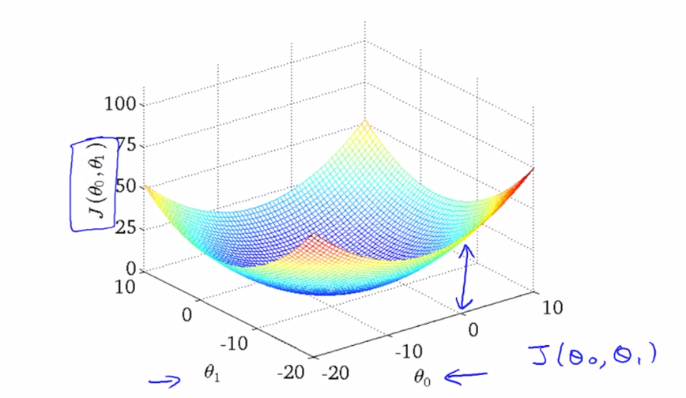

## Linear Regression

##### SLIDES
- [Introduction 📑](../../assets/doc/Lecture1.pdf)
- [Linear Regression with Gradient Descent📑](../../assets/doc/Lecture2.pdf)
- [Matrix & Vector 📑](../../assets/doc/Lecture3.pdf)

## ML Types

#### Supervised learning
  - Test Data have lables
  - We are given a data set and already know what our correct output should look like, having the idea that there is a relationship between the input and the output.
  - Eg. Cancer detection based on Cancer data base

 1. **Regression**: predict results within a continuous output, meaning that we are trying to map input variables to some continuous function. 

 2. **Classification** we are instead trying to predict results in a discrete output. In other words, 
we are trying to map input variables into discrete categories eg true false.

#### Unsupervised learning
 - Test Data have no labels.
 - Automatically find Cluster, group & Pattern in input data
 
  **Clustering Algorithm:** Group customer in market segment, group friends in FB, group news.
  **Cocktail Party Algorithm:** Separation of voice from music.
  
  ------------------
  
### Training Set

Training Set is the Data that is feed to Leaning Algorithm. Learning function outputs a hypothesis function 

     X = input (Size of House)
     Y = output (Price)
    (X,Y) = Row in Training Set: single training example
    (Xi,Yi) = ith training example
     m = Number of Training Examples

> h maps X to Y, For a given size of House h will predict Price of House)

###How to represent h

#### Linear Regression with 1 Variable X OR Uni variable Linear Regression
   
Linear regression is method of finding a Continues Liner relationship between Y and X        

         hΘ(x) = Theta0+Theta1(X)x
         => y= y0 + mx
         where  Theta0 = y offset (Y0) 
                Theta1 = slope (m) form x Axis
                
- Theta0 = 0  means y= mx, pass through origin
- Theta1 = 0  means Horizontal Line parallel to X axis               
               
 #### Squared Error Cost Function:  
> - Goal of the algorithm is to choose Theta0 & Theta1 such that h(X) come close to Y . Minimize J(Theta0, Theta1)thus minimize Error                         
> - Squared error cost function work well for most regression programs

          J(Theta0, Theta1) =  1/2m(Sum((predicted-actual)**2))              
                            =  1/2m(Sum((h(xi)-y(i))**2)) 
                            =  1/2number of dataSet(Sum of Deviation from actual)**Squared to remove negative
            
  
  

                     
- Plot of  J(Theta0, Theta1) vs Theta1 is Parabola
- Plot of  J(Theta0, Theta1) vs Theta0,Theta1 is 3D Parabola    

   

### Contour Figure/ Plot 2D Plot of 3D  surface    

Contour plot is seeing surface plot passing through a horizontal 2D clip plane

- X axis in Contour Figure = Theta0 =  Y Intercept of Hypothesis in X,Y Plot
- Y axis in Contour Figure =  Slope =  Slope of Hypothesis Line  in X,Y Plot   
                            
  
                   
-----

## Gradient Descent
> Algorithm used to reduce Cost function J(Theta0, Theta1) and other functionsJ (Theta0, Theta1,Theta1....Thetai) in ML, where
- Just like going down from a hill.
- Look around and find local minima and keep on going down repeat till find optimal solution.
- **Multiple minima  can be found**

 
 
**Steps:** 
 - For feature index j= 0,1, repeat until convergence
 
   
 - Simultaneous compute Theta(0), Theta (1) and store in temp values
 - Simultaneous Update  Theta(0), Theta (1)
 
 **Operator**

       := Assignment Operation eg a= a+1
       =  Truth Assertion eg a==a
       α  Learning Rate, How big steps we take down hill
       d(CostFn)/d(Theta) the sensitivity to change of the function value with respect to a change in its argument.

Alpha defines rate of Learning

 - Low Alpha: slow learning rate
 - Big Alpha: big steps can diverge from minima
       

Derivative terms defines rate of change of Cost function wrt Theta(1). 

-  At local minima Derivative Term is = 0.
-  Derivative term automatically converge Theta1 towards its local minima from both +ve and -ve slopes:

   

-  Derivative term automatically takes small step when it starts to converge towards local minimal. Having a fixed alpha helps      
       
 ------      

Matrix: 
- Dimension of matrix = row X column
- Aij = i'th row j'th column, index starts with 1
- Represented by Capital Case

Vector
- Matrix of nX1 Dimension(n Dimension Vector)
- Single RowX Multiple Column 
- vi = i'th element
- Represented by Capital Case

### Oprations

#### Addition, Subtraction

- Their dimensions must be the same.
- Add or subtract each corresponding element in Matrices

#### Multiply, Divide by Scalar
- Multiply or divide each element by the scalar value.

#### Matrix-Vector Multiplication

> (M x N Matrix)*( N X 1 Vector )= M dimentional Vector

**Usage:**

Faster single Hypothesis Prediction calculation given data set and Thetas
**Much faster than nested for loops

> #### Data Matrix * Parameter Vector = Prediction Vector 

    h(x) = Theta0 + Theta1x
    [1 , x]*[Theta Vector] = [h(x)]

  

#### Matrix-Matrix Multiplication

> (M x N Matrix)*( N X O Matrix )= M*O Matrix

**Usage:**

Faster multiple Hypothesis Prediction calculation given data set and Thetas
**Much much faster than nested for loops

> #### Data Matrix * Parameter Matrix = Prediction Matrix 

      given h(x) = Theta0 + Theta1x
      [1 , x]*[Theta Matrix] = [h(x)]

  
  
  - Not Commutative : A.B !=B.A
  - Associative : (A.B).C = A.(B.C)
  
  
#### Identity Matrix:
  I is called identity matrix of A if:
  
  - A.I = I.A = A
  - All elements are 0, except diagonals elements are 1.
  
  #### Inverse Matrix(A-1)
  
  A' called inverse if
  
  - A'.A = A'.A = I
  
  Matrix without Inverse called **Degenerate Matrix**

  ####  Matrix Transpose(AT)
  
For A(mxn) matrix , B = AT if Row become Column:

 >- B is mxn matrix
 > - Bij = Aij 
  

---

