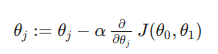

## Introduction to MatLab:

> MatLab is the Language of Mathematical Computation

                                                       
- [Certificate MatLab 📑](../../assets/certificate/MatLab.pdf)
- [Study Notes MatLab 📑](../matlab/MathLab.md)

  

---

## Multi Variant Linear Regression

####Linear regression with multiple variables is also known as "multivariate linear regression".

Suppose y is function of multiple variables x then

>#### Xcolumn(row) : X(i, j)
>  - **m**  = number of training example
> - **n**  =  number of feature in training example
> - **x(i)** = ith row in training example/ feature in example
> - **xj(i)** = ith row , jth column in training example
>  

Linear Regression for Hypothesis for n features :   

> hΘ(x) =  Θ0X0 +Θ1X1 +Θ1 X2+ Θ1 X3+ ...ΘnXn
> 
>Assume X0= 1 for convenience
>
> hΘ(x) =  Θ0X0 +Θ1X1 +Θ1 X2+ Θ1 X3+ ...ΘnXn
> 
> ###hΘ(x) = ΘTX
>  #####Inner Product of RowVector0(1*n)* Column VectorX(n*1) = Scalar()1*1 Hypothesis

Notes:

-  ΘT is a 1 by (n+1) matrix and not an (n+1) by 1 matrix 
- **x0(i)** =1  for matrix multiplication 

------------------

### Simple Linear Regression

#### Cost function: 
  
  
       J(Theta0, Theta1) =  1/2m(Sum((predicted-actual)**2))              
                         =  1/2m(Sum((h(xi)-y(i))**2)) 
                         =  1/2number of dataSet(Sum of Deviation from actual)**Squared to remove negative
                

  
#### Gradient Descent:  
  **Steps:** 
 - For feature index j= 0,1, repeat until convergence
 
   
 - Simultaneous compute Theta(0), Theta (1) and store in temp values
 - Simultaneous Update  Theta(0), Theta (1)
 
  
### Multi variant Linear Regression  

#### Cost Function

      J(Theta0, Theta1, Theta.....Thetam) =  1/2m(Sum((predicted-actual)**2))              
                             =  1/2m(Sum((h(xi)-y(i))**2)) 
                             =  1/2number of dataSet(Sum of Deviation from actual)**Squared to remove negative
                    
   
> J(Theta) =  1/2m(Sum((predicted-actual)**2))              
    
           
  

#### Gradient Descent:  

 **Steps:** 
 - For feature index j= 0,1,....n repeat until convergence
 
   
   
 - Simultaneous compute Theta(0), Theta (1), .... Theta (n)  and store in temp values
 - Simultaneous Update  Theta(0), Theta (1) .... Theta (n) 
 
-----

## Feature scaling

> Make sure feature are on same scale other wise contour will be skew elliptical(2000/5).
> Gradient descent on skew Eclipse  take long time to reach local minima

 > ##### xi = (xi--min(X))/(max(X)-min(X))

-  Try to get feature into -1<= xi<= 1. Long gape will not fully scaled. Idellay should be withing range -3 to +3.

Feature scaling is way to avoid creating skew ellipse:

   
   
### Mean Normalization   

Use mean and max range to normalize x values

 > ##### xi = (xi-Avg(X))/(max(X)-min(X))

   

 > ##### xi = (xi-Avg(X))/(max(X)-min(X))

### Debugging gradient descent using Learning Rate

>  plot the cost function, J(θ) over the number of iterations of gradient descent. If J(θ) ever increases, then you probably need to decrease α.

- If α is too small: slow convergence.

- If α is too large: may not decrease on every iteration and thus may not converge.

   
   
--------------------------

## Polynomial Regression

> Sometimes by defining a new feature you might get a better Model that requires less computation

for example house price can defined by calculating area instead of creating 2 variable equation we can define one variable equation :

   
   
- Sometimes prediction fits Polynomial equation instead of linear equation
- Scaling of feature becomes crucial in Polynomial Regression
- Some algo can choose feature to fit polynomial curves

   
   
