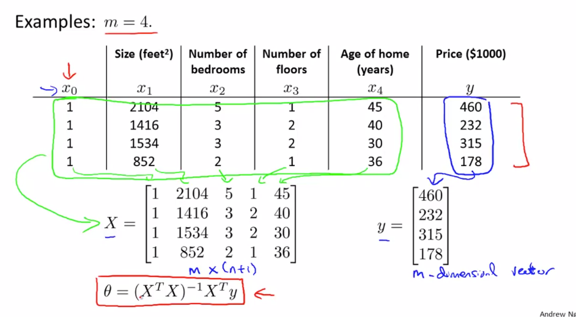

##  Normal Equation

> #### Instead of solving multiple iteration of gradient descent, Normal equation can get theta in one step 

Θ can be calculated where cost function is minimal using calculas in one step instead of iterating

### Steps:
- Construct design matrix X using feature columns and add 1 in first column
- Construct y vector using result values Y
- calculate:
 
> #### Θ =  (XTX)-1 XTy

 

> #### Feature scaling is not required for Normal Equation method

### Normal Equation vs Gradient Descent:

|     Feature    | Gradient Descent           | Normal Equation  |
| -------------  |:-------------:| -----:|
|Complexity  |  Complex need to debug alpha | Convenient & Simple to implement |
|Choose Learning Rate(α)    |  Required  | No need |
| Feature Scaling     | Required      |   No need |
| Iteration | Many Iteration Required     |   Not required |
| Feature Set>=million | Efficient if n is huge   O(kn2)  |  **Slow if n is huge, cost of inverse matrix is O(n3)**|
| Complex Learning Algo | Can used for Complex learning algo     |   Not supported |

----

  #### Inverse Matrix(A-1)
  
  A' called inverse if
  
      A'.A = A'.A = I
 
 >   ##### Matrix without Inverse called **Degenerate Matrix/ Singular/ Non Invertible**

##### Cause for non invertible Matrix:

- __Redundant feature:__ two feature related by a linear equation x2 = kx1 eg: size in feet and meter
- __More feature than training set(m<=n)):__ delete some feature or use regularization

##### Octave method for inverting matrix:

 - __pinv(A)__ : **Pseudo Inverse**, calculates inverse even if matrix is non invertible
 - __inv(A)__  : Inverse
